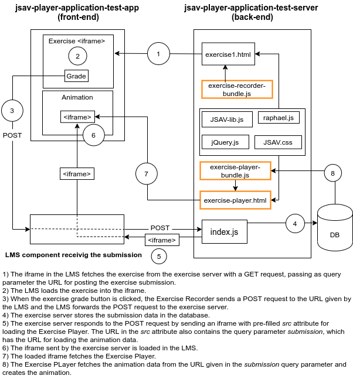

# JSAV-Player-testing-app

This a simple React app, the front-end of the test application for the [JSAV Player Application](https://github.com/MarianiGiacomo/jsav-player-application). You can see it deployed [here](), using our [jsav-player-application-test-server](https://github.com/MarianiGiacomo/jsav-palyer-application-test-server/tree/master) as back-end. Beware that they are both in continuous development, so the deployed version might be different from what you find in the repos, might not be working properly etc...

If you want to run it up on your own, there are few settings to be done before using the app:
- Setting for the back-end
- Settings for single exercises


## Settings for the Back-End
You will need a back-end for serving the exercises, the [Exercise Recorder](https://github.com/MarianiGiacomo/jsav-exercise-recorder/tree/master), and the [Exercise Player](https://github.com/MarianiGiacomo/jsav-exercise-player/tree/master). As server you can set up your own [jsav-player-application-test-server](https://github.com/MarianiGiacomo/jsav-palyer-application-test-server/tree/master), or any other server of your choice. You can also use our own test server at https://gentle-fjord-22671.herokuapp.com.

If you set up your own [jsav-player-application-test-server](https://github.com/MarianiGiacomo/jsav-palyer-application-test-server/tree/master), then you will also need a MongoDB database, which you will have to set up on your own, and configure its connection in the [jsav-player-application-test-server](https://github.com/MarianiGiacomo/jsav-palyer-application-test-server/tree/master).

In [`src/conf.js`](https://github.com/MarianiGiacomo/jsav-player-application-test-app/blob/master/src/conf.js) you will have to do the following configurations:
- `mode`: if set to "test" the server url will be the one set in `testserver`, if any other string value is give, the server url used will be the address given in `exerciseServer`.
- `exerciseServer`: the production server address.
- `testServer`: the test server address.
- `POST_URL`: the url where the [Exercise Recorder](https://github.com/MarianiGiacomo/jsav-exercise-recorder/tree/master) will send the data recorded from the exercise. If it is set to "window", the Exercise Recorder will post the data to the window that loaded it, which in our case would be this test application. For this test application, the `POST_URL` must be set to "window".


```
const mode = "test";
const exerciseServer = "<address of you sever>";
const testServer = "http://localhost:8000";

const SERVER = mode === "test"? testServer : exerciseServer;
const POST_URL = 'window';
```


## Settings for Single Exercises
In [`src/conf.js`](https://github.com/MarianiGiacomo/jsav-player-application-test-app/blob/master/src/conf.js) add the configurations for each exercise you want to fetch from the server. In this repo you might find them ready to work with the [jsav-player-application-test-server](https://github.com/MarianiGiacomo/jsav-palyer-application-test-server/tree/master), but you can also change them to suite your needs. The only parameters which really matter at the moment are `SERVER`, `path`, and `POST_URL`. The other parameters are there to simulate the A+ Learning Management System grader protocol. Some of them will be recorded by the Exercise Recorder as metadata (`title`, `uid`), others might be recorded in the future.

- `path`: the pathname of the exercise on the server.
- `SERVER`: see above in "Settings for the Back-end".
- `sumbission_url`: passed as URL parameter when fetching the exercise. Can be used by the
Exercise Recorder if it grades asynchronously. Currently not supported.
- `uid`: user identification number (the person doing the exercise).

```
const EXERCISES = [
  {
    title: "Insertion Sort",
    SERVER,
    path: "/exercises/insertionSort.html",
    submission_url: "",
    POST_URL,
    max_points: 20,
    uid: "test user",
    ordinal_number: 1
  },
  {
    title: "Insertion Sort without Swap",
    SERVER,
    path: "/exercises/insertionSortWithoutSwap.html",
    submission_url: "",
    POST_URL,
    max_points: 20,
    uid: "test user",
    ordinal_number: 2
  }
]
```
## How the Application Works (in brief)

- The exercises added to the EXERCISES object will be loaded into an `<iframe>` using the given `SERVER/path` passing the URL parameters `post_url`, `title`, `submissoin_url`, `max_points`, `uid`, `ordinal_number`.
- The exercise received from the server loads the [Exercise Recorder](https://github.com/MarianiGiacomo/jsav-exercise-recorder/tree/master) and all needed libraries (this step is not concern of this test application).
- When the user clicks the grade button in the exercise, the [Exercise Recorder](https://github.com/MarianiGiacomo/jsav-exercise-recorder/tree/master) will post the recorded data to the URL given in the `post_url` parameter (this step is not concern of this test application).
- The test application window receives the posted data and posts it to the URL given in `SERVER`.
- The server, in our case the [jsav-player-application-test-server](https://github.com/MarianiGiacomo/jsav-palyer-application-test-server/tree/master), responds with an `<iframe>` as string, which is ready for loading the [Exercise Player](https://github.com/MarianiGiacomo/jsav-exercise-player/tree/master).
- The test application inserts the received `<iframe>` into a modal window and the [Exercise Player](https://github.com/MarianiGiacomo/jsav-exercise-player/tree/master) loads.


